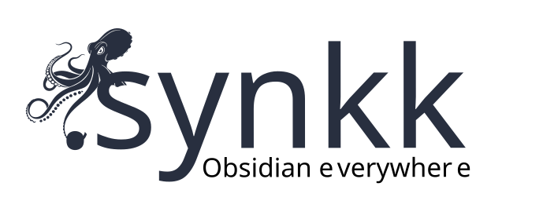
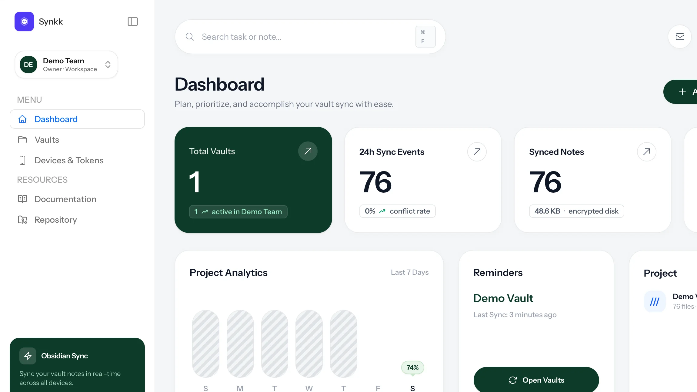

# Synkk Team Vault Sync

<p align="center">
  
</p>

<p align="center">
  <strong>Whole-file team vault sync, real-time Yjs multiplayer, and zero-knowledge E2EE for Obsidian, powered by a self-hosted Synkk server.</strong>
</p>

<p align="center">
  <a href="https://synkk.space">Website</a> ·
  <a href="https://synkk.space/p/synkk-docs">Live Docs Portal</a> ·
  <a href="https://synkk.space/documentation">Docs</a> ·
  <a href="https://github.com/tawandajosephmutsena/synkk">Server repo</a> ·
  <a href="https://github.com/tawandajosephmutsena/synk-obsidian-plugin/releases/latest">Latest release</a> ·
  <a href="https://ottomate.space">Ottomate</a>
</p>



Synkk Team Vault Sync connects an Obsidian vault to a Synkk team server. It is designed for teams and individuals that need private infrastructure, member/device access control, path-specific permissions, real-time multiplayer collaboration, zero-knowledge encryption, and recoverable sync history without turning every user into a Git operator.

## Product Screens

| Web Dashboard | Markdown Editor |
| --- | --- |
|  |  |

| Graph View | Permissions Matrix |
| --- | --- |
|  |  |

## Core Capabilities

- **Cross-Platform Sync:** macOS, Windows, Linux, iOS, and Android support through Obsidian's plugin runtime.
- **First-Sync Pre-Flight & Migration Wizard:** Built-in 4-phase diagnostic wizard that inspects local vaults prior to first sync, groups files (Markdown, Canvases, Images, Media, PDFs), sanitizes illegal cross-platform characters (`: * ? " < > | \`) with a single click, simulates quota and change counts via dry-run API, and prevents mass wipes with the 20% Atomic Safety Shield.
- **One-Scan QR Pairing:** Instant device setup using the `obsidian://synkk-pair` deep link protocol. Scan a QR code in the Synkk web dashboard to connect your mobile or desktop device in 2 seconds.
- **Interactive Livewire Vault Portals:** Publish your vault as an interactive web portal at `/p/{slug}` in real time with 4 design presets, instant Livewire fuzzy search, and interactive backlinks. [Explore the live Synkk Docs Portal](https://synkk.space/p/synkk-docs).
- **Real-Time Multiplayer Collaboration (Yjs):** Real-time concurrent Markdown editing powered by Yjs CRDTs over Laravel Reverb, with remote awareness carets, shared undo history, and offline convergence.
- **Zero-Knowledge Client-Side Encryption (E2EE):** High-entropy AES-256-GCM client-side encryption for E2EE vaults. Plaintext notes and Yjs updates never touch server disks unencrypted.
- **On-Demand Ghost Files:** Dehydrate large attachments into lightweight stubs to keep mobile vaults lean, with one-click on-demand hydration.
- **Access Control & Path Rules:** Scoped device tokens, team membership, and granular path-level `read_write`, `read_only`, and `hidden` permissions.
- **Content Integrity:** SHA-256 content verification, atomic safety shields, deletion abort thresholds, and preserved `*.sync-conflict-*.md` backup copies.
- **Selective Sync & Config:** Per-device include/exclude folder rules and optional `.obsidian` configuration syncing.
- **Recoverable History:** Web Time Machine for server-side file-version rollback and recovery.

## Security & Architecture Disclosures

- **E2EE Vaults:** When client-side encryption is enabled, file contents and real-time collaboration updates are encrypted and decrypted strictly on your client device using WebCrypto AES-256-GCM. The Synkk server only stores and routes opaque ciphertext blobs. For E2EE vaults, server-side search and RAG indexing are intentionally disabled to guarantee zero server knowledge.
- **Standard Vaults:** For standard (non-E2EE) vaults, the server receives file contents over HTTPS so it can store, authorize, version, index for local RAG, and restore them.
- **Transport Security:** Always deploy the Synkk server behind HTTPS and configure trusted reverse proxies appropriately.

## Installation & Quick Setup

### Method 1: Instant One-Scan Pairing (Recommended)

1. In Obsidian, install and enable the **Synkk Team Vault Sync** plugin.
2. In your Synkk web dashboard, navigate to **Devices -> Pair Device**.
3. Scan the generated QR code with your mobile camera or click **Copy Deep Link** on desktop (`obsidian://synkk-pair?...`).
4. Obsidian will automatically configure the server URL, scoped token, and vault bindings.

### Method 2: Manual Installation

1. Download `main.js`, `manifest.json`, and `styles.css` from the [latest release](https://github.com/tawandajosephmutsena/synk-obsidian-plugin/releases/latest).
2. Create `<vault>/.obsidian/plugins/synkk-sync/`.
3. Place the three release files in that directory.
4. In Obsidian, open **Settings -> Community plugins** and enable **Synkk Team Vault Sync**.
5. In **Settings -> Synkk Vault Sync**, enter your HTTPS server URL ending in `/api/v1`, paste your device token, and choose the target vault.

## Development

```bash
npm ci
npm run build
npm test
```

The production command compiles TypeScript and bundles `main.js`. Release packages also include `manifest.json` and `styles.css`.

## Links

- Public app: [synkk.space](https://synkk.space)
- Documentation: [synkk.space/documentation](https://synkk.space/documentation)
- Server repo: [github.com/tawandajosephmutsena/synkk](https://github.com/tawandajosephmutsena/synkk)
- Plugin repo: [github.com/tawandajosephmutsena/synk-obsidian-plugin](https://github.com/tawandajosephmutsena/synk-obsidian-plugin)
- Creator studio: [Ottomate](https://ottomate.space)

## Creators

Synkk is created by [Ottomate](https://ottomate.space). Product direction and engineering are led by [Tawanda Joseph Mutsena](https://github.com/tawandajosephmutsena).

## License

The plugin is licensed under the [MIT License](LICENSE).
